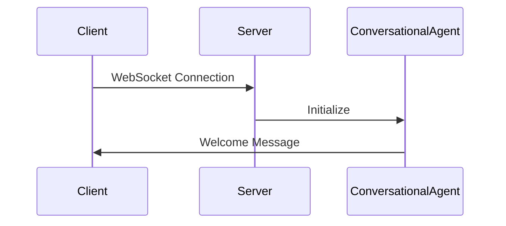
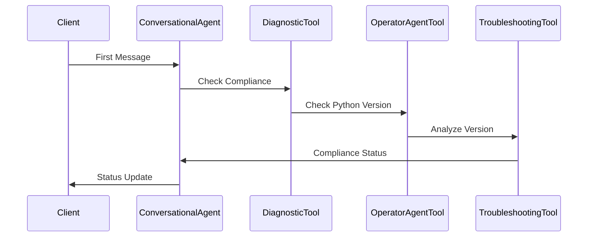
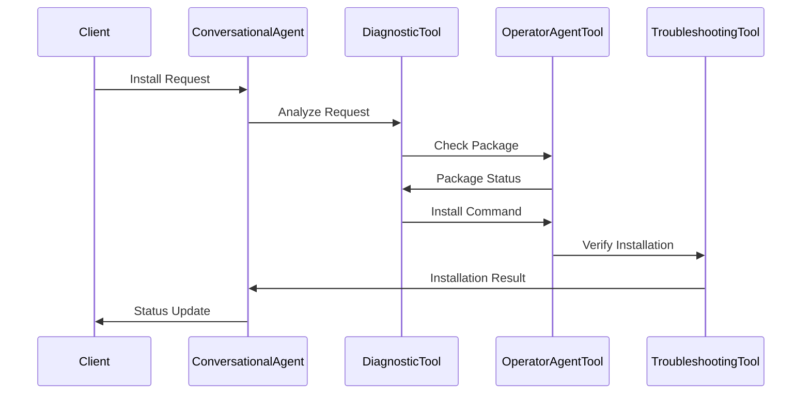

# Multi-Agent VDI Support System Documentation

## Overview
This application is a sophisticated multi-agent system designed to provide Virtual Desktop Infrastructure (VDI) support through a WebSocket-based chat interface. The system employs multiple specialized agents working in concert to handle system diagnostics, operations, and user interactions.

## System Architecture

### Core Components

1. **Server Components**
   - FastAPI WebSocket Server (port 8000)
   - Operator Agent Server (port 8501)
   - NVIDIA AI Language Model Integration

2. **Agent Hierarchy**
   ```
   ConversationalAgent
   ├── DiagnosticTool
   ├── TroubleshootingTool
   └── OperatorAgentTool
   ```

3. **Client Component**
   - React-based chat interface
   - WebSocket client
   - Voice input/output capabilities

## Detailed Component Description

### 1. Base System (`base.py`)

#### Key Classes
- `SystemContext`: Maintains system state information
  ```python
  @dataclass
  class SystemContext:
      python_version: Optional[str]
      system_checked: bool
      is_compliant: bool
      current_operation: Optional[str]
      installed_packages: Dict[str, str]
  ```

- `ConversationContext`: Manages conversation state and history
  ```python
  class ConversationContext:
      messages: List[Dict[str, Any]]
      system_context: SystemContext
      last_agent: Optional[str]
  ```

- `LLMHandler`: Manages interactions with NVIDIA AI endpoints
  - Model: meta/llama-3.3-70b-instruct
  - Temperature: 0.2
  - Top P: 0.7
  - Max Tokens: 1024

### 2. Tools System (`tools.py`)

#### OperatorAgentTool
- **Purpose**: Executes system operations through GUI interfaces
- **Key Features**:
  - WebSocket communication with Operator Agent
  - Command type detection and execution
  - Context updates
  - Timeout handling
  - Response validation

#### DiagnosticTool
- **Purpose**: Analyzes system state and issues
- **Capabilities**:
  - Package installation analysis
  - System compliance checks
  - Issue diagnostics
  - Integration with OperatorAgentTool

#### TroubleshootingTool
- **Purpose**: Resolves identified issues
- **Functions**:
  - Package operation analysis
  - Python version compliance checks
  - Resolution steps generation

### 3. Agents System (`agents.py`)

#### ConversationalAgent
- **Primary Interface**: Manages user interactions and agent coordination
- **Key Responsibilities**:
  1. System compliance verification
  2. Message routing
  3. Response generation
  4. Agent coordination

### 4. Main Application (`main.py`)

#### Server Configuration
```python
app = FastAPI(lifespan=lifespan)
app.add_middleware(CORSMiddleware)
```

#### WebSocket Handler
- Manages connections
- Routes messages
- Handles errors
- Maintains connection state

## Communication Flow

### 1. Initial Connection


### 2. System Compliance Check


### 3. Package Installation Flow


## Error Handling

### 1. Connection Errors
- Automatic reconnection attempts (max 5)
- Error messaging to client
- Connection state tracking

### 2. Operation Timeouts
- 30-second operation timeout
- 10-second message timeout
- Graceful timeout handling

### 3. Command Failures
- Detailed error reporting
- Status tracking
- Recovery attempts

## System Requirements

### Python Version
- Minimum: Python 3.10
- Recommended: Python 3.11+

### Dependencies
```plaintext
fastapi
uvicorn
websockets
langchain_nvidia_ai_endpoints
python-dotenv
```

### Environment Variables
```plaintext
NVIDIA_API_KEY=your_api_key
API_PROVIDER=anthropic
```

## Implementation Details

### Message Format
```json
{
    "type": "message",
    "content": {
        "type": "text",
        "text": "[Agent]: Message content"
    }
}
```

### Context Management
```python
context = ConversationContext()
context.add_message(role="user", content="message")
context.get_recent_context(limit=5)
```

### Agent Response Format
```python
AgentResponse(
    message="[Agent]: Response",
    next_action="action_type",
    data={"key": "value"}
)
```

## Security Considerations

1. **API Key Management**
   - Stored in .env file
   - Not exposed to client

2. **WebSocket Security**
   - CORS configuration
   - Connection validation

3. **Error Handling**
   - Sanitized error messages
   - Secure error logging

## Best Practices

1. **Message Processing**
   - Validate all messages
   - Maintain proper agent prefixes
   - Handle timeouts gracefully

2. **Context Management**
   - Regular context updates
   - Proper state tracking
   - History management

3. **Agent Coordination**
   - Clear responsibility delegation
   - Proper handoffs
   - Status tracking

## Troubleshooting

### Common Issues
1. Connection Timeouts
   - Check operator agent availability
   - Verify network connectivity
   - Check port availability

2. Package Installation Issues
   - Verify pip functionality
   - Check package availability
   - Verify system permissions

3. Context Issues
   - Clear conversation context
   - Reset system context
   - Verify agent state

## Future Improvements

1. **Enhanced Security**
   - User authentication
   - Session management
   - Rate limiting

2. **Performance Optimization**
   - Message caching
   - Context pruning
   - Response optimization

3. **Feature Additions**
   - More package support
   - Enhanced diagnostics
   - Improved error recovery

## Maintenance

### Regular Tasks
1. Log rotation
2. Context cleanup
3. Connection monitoring
4. Error analysis

### Monitoring
1. Active connections
2. Response times
3. Error rates
4. System compliance

This documentation provides a comprehensive overview of the system's architecture, components, and operations. For specific implementation details, refer to the individual component files and inline documentation.