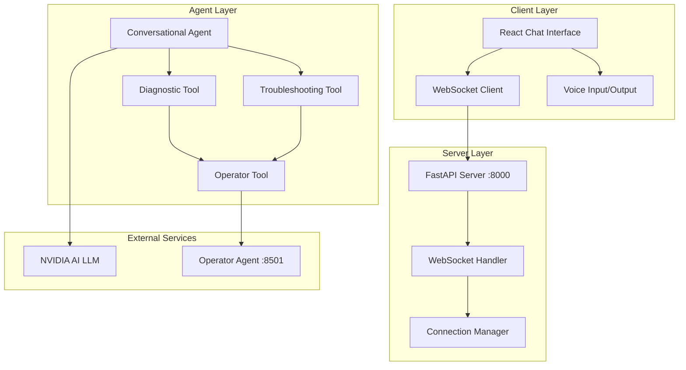
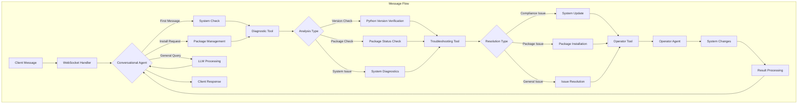
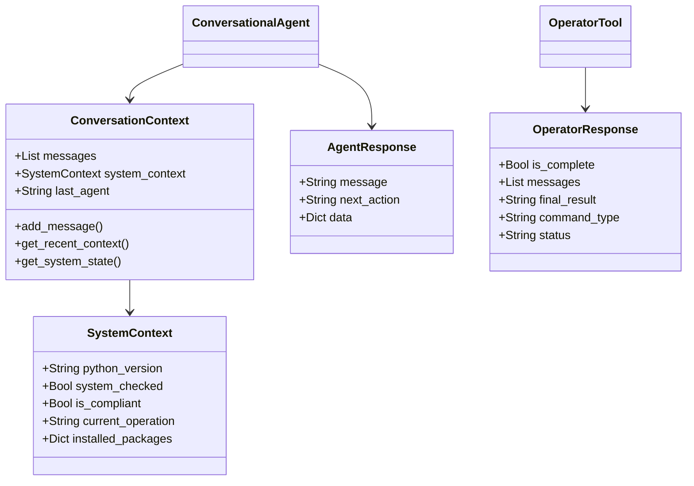
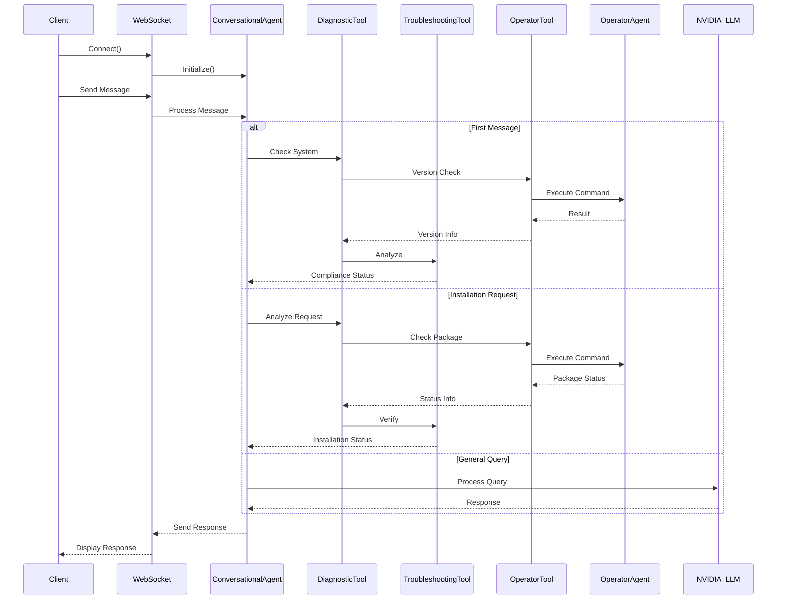

Here's a comprehensive architecture diagram using Mermaid code. I'll break it down into several connected diagrams for better clarity:

And here's a more detailed flow diagram:

And here's the context and state management diagram:

And finally, the component interaction diagram:

This set of diagrams provides a comprehensive view of:
1. Overall system architecture
2. Detailed message flow
3. Context and state management
4. Component interactions
5. Sequence of operations

Each diagram highlights different aspects of the system:
- First diagram: System components and their relationships
- Second diagram: Detailed message processing flow
- Third diagram: Data structure relationships
- Fourth diagram: Temporal sequence of interactions

These diagrams can be rendered using any Mermaid-compatible markdown viewer or editor.